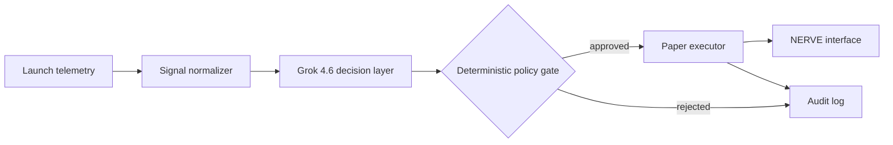

# NERVE

**Grok-powered risk decisions for high-velocity token launches. Paper execution by default.**

[](https://docs.x.ai/developers/models/grok-4.6)
[](#public-scope)
[](https://nodejs.org/)

[Open the NERVE interface](https://nerve-execution-live.emailnepotenka.chatgpt.site/)

Most launch bots optimize for being first. NERVE optimizes for knowing when **not** to enter.

It turns noisy launch telemetry into a strict risk decision, passes that decision through a deterministic policy gate, and only then hands an approved order to an executor. Grok is the decision layer; it never holds private keys and cannot bypass execution limits.

## How it works



Grok evaluates a normalized snapshot and returns a schema-locked decision:

- `enter`, `watch`, or `reject`
- confidence and risk level
- per-signal checks with human-readable reasons
- maximum position size and slippage ceiling

The policy gate then applies hard rules in code. A persuasive model response is not enough to place an order.

## Run the proof locally

Requires Node.js 20 or newer. The mock path is dependency-free and does not need an API key.

```bash
npm run demo:mock
```

To send the same normalized signal through Grok:

```bash
cp .env.example .env
# add your XAI_API_KEY to .env or export it in your shell
npm run demo
```

NERVE calls the xAI Chat Completions endpoint with a strict JSON schema. The default model is `grok-4.6`; override it with `XAI_MODEL` if needed.

## Public scope

This repository is a public proof of the Grok decision path and a safe paper-execution demo.

- The interface P&L and fills are simulated.
- The included executor cannot submit an on-chain transaction.
- Production collectors, wallet signing, and private infrastructure are not published here.
- No API keys, wallet keys, or user credentials belong in this repository.

NERVE is experimental software, not financial advice. Do not connect real capital without independent security review, explicit user authorization, spend limits, monitoring, and an emergency stop.

## Project layout

```text
src/
  decision-schema.mjs  strict output contract
  grok-client.mjs      xAI/Grok API client
  policy-gate.mjs      deterministic safety rules
  paper-executor.mjs   non-custodial simulation only
  demo.mjs             runnable end-to-end example
```

## Why Grok

The model handles the ambiguous layer: combining weak, conflicting signals into an explainable decision. Code retains authority over the irreversible layer: limits, approval, signing, and execution.

That separation is the point of NERVE.
